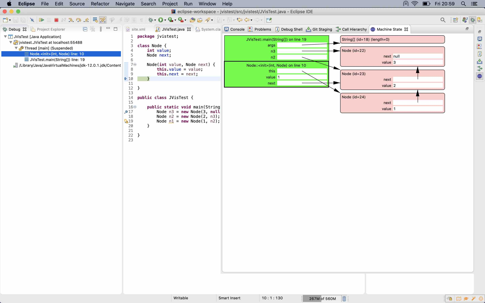

# JVis

An Eclipse plugin that contributes the Machine State view, which
provides a graphical view of the call stack and the heap during a debug session.

## How to use

1. Install the plugin (*Help* -> *Install new software* -> *Add...*; for *Location*, enter `https://dl.bintray.com/jvisorg/jvis`).
2. Create a Java project, write some code (declare some variables, create some objects), put a breakpoint. Go to the Debug perspective.
3. Show the Machine State view (*Window* -> *Show view* -> *Other...* -> *JVis* -> *Machine State*).
4. Start debugging. The Machine State view will show the call stack and the heap.
